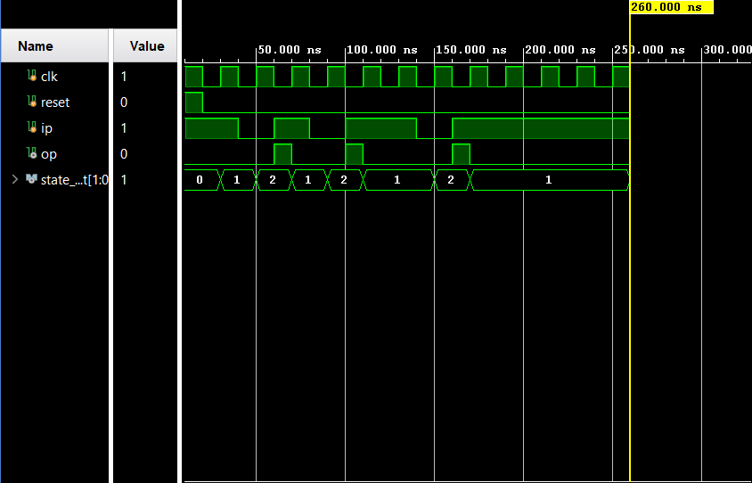
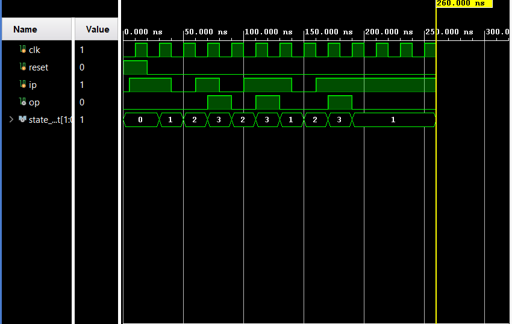

# SEQUENCE-DETECTOR-FSM

## Overview

This project implements overlapping sequence detectors using Verilog HDL and Finite State Machine (FSM) design techniques. Both Mealy and Moore machine implementations are included for detecting the binary sequence `101`. The designs were verified through RTL simulation and waveform analysis.

---

## Features

- Mealy Sequence Detector
- Moore Sequence Detector
- Overlapping Pattern Detection
- FSM-Based Design
- RTL Simulation and Verification
- State Transition Analysis

---

## Pattern Detected

```text
101
```

### Detection Type

```text
Overlapping Sequence Detection
```

Example:

```text
Input Stream : 10101

Detection #1 : 101
Detection #2 :   101
```

---

## Mealy Overlapping Sequence Detector

The Mealy implementation generates the output based on the current state and input. Detection occurs immediately when the final bit of the sequence is received.

### States

```text
S0 : Initial State
S1 : 1 Detected
S2 : 10 Detected
```

---

## Moore Overlapping Sequence Detector

The Moore implementation generates the output based only on the current state. An additional state is used to indicate successful sequence detection.

### States

```text
S0 : Initial State
S1 : 1 Detected
S2 : 10 Detected
S3 : 101 Detected
```

---

## Project Structure

```text
SEQUENCE-DETECTOR-FSM
│
├── RTL Design
│   ├── mealy_overlapping.v
│   └── moore_overlapping.v
│
├── TESTBENCH
│   └── tb_olp.v
│
├── SIMULATION
│   ├── mealy_waveform.png
│   └── moore_waveform.png
│
└── README.md
```

---

## Simulation Results

### Mealy Overlapping Sequence Detector



### Moore Overlapping Sequence Detector



---

## Concepts Practiced

- Finite State Machines (FSM)
- Mealy Machine Design
- Moore Machine Design
- State Encoding
- State Transition Logic
- Sequential Logic Design
- Overlapping Sequence Detection
- Verilog HDL
- RTL Simulation and Verification

---

## Author

**Madhu Visagan H T**
 
Digital VLSI and FPGA Design Enthusiast

---
